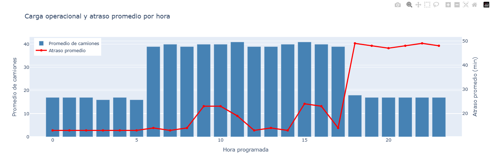
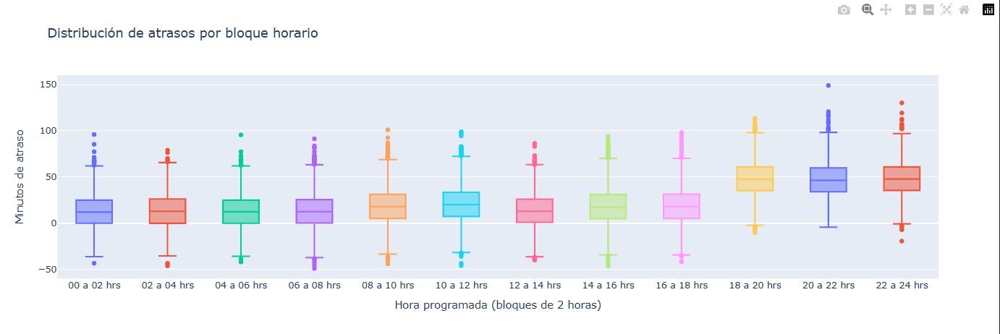

## 🚚 Predicción de atrasos en operaciones logísticas

Este proyecto desarrolla un modelo de *Machine Learning* para predecir retrasos en operaciones logísticas y generar alertas tempranas sobre posibles casos críticos.

El objetivo es anticipar retrasos en la atención de camiones utilizando variables operacionales, permitiendo priorizar operaciones con mayor riesgo de atraso y apoyar la toma de decisiones en la gestión logística.

---

## Descripción del proyecto

En operaciones logísticas con alta carga operativa, los retrasos en la atención de camiones pueden generar congestión, ineficiencias y costos adicionales.

Este proyecto propone un enfoque basado en *Machine Learning* para estimar los minutos de atraso de una operación logística antes de su ejecución.

---

## Análisis exploratorio

## Distribución de atrasos por empresa y hora programada

Este gráfico muestra cómo varían los atrasos dependiendo de la empresa transportista y la hora programada.

---

## Carga operacional y atraso promedio

Se observa una relación entre el volumen de operaciones programadas y el incremento en los minutos de atraso promedio durante ciertos horarios del día.

---
## Distribución de atrasos por bloque horario

El gráfico muestra cómo varía la distribución de los minutos de atraso dependiendo del bloque horario en que se programa la operación. 
Se observa un aumento en la mediana y en la dispersión de los atrasos hacia las últimas horas del día, lo que sugiere un posible efecto de acumulación operacional.

---

## Metodología

El proyecto sigue las etapas típicas de un proyecto de Data Science:

1. Análisis exploratorio de datos (EDA)
2. Ingeniería de variables
3. Entrenamiento de modelos de Machine Learning
4. Evaluación comparativa de modelos
5. Optimización de umbral para detección de atrasos críticos
6. Interpretabilidad del modelo mediante SHAP

---

## Resultados del modelo

El modelo con mejor desempeño fue *XGBoost*, obteniendo:

- *MAE:* ~11–12 minutos  
- *R²:* ~0.57  

Esto permite estimar los minutos de atraso con suficiente precisión para apoyar decisiones operacionales.

---

## Implicancias operacionales

El modelo permite generar *alertas tempranas de retrasos*, lo que abre oportunidades para mejorar la gestión logística:

- priorización de camiones con mayor riesgo de atraso
- anticipación de congestión operacional
- mejor planificación de recursos operativos
- monitoreo del desempeño logístico

---

## Tecnologías utilizadas

- Python
- Pandas
- NumPy
- Scikit-learn
- XGBoost
- SHAP
- Matplotlib
- Seaborn
- Plotly

---
# Estructura del repositorio

## Logistics-delay-prediction/
## Notebook/
    - logistics-ml.ipynb

## outputs/
    - figures/
        - heatmap_atrasos.png
        - carga_operacional_atrasos.png
        - distribucion_atrasos.png
        - shap_importance.png

- README.md
- LICENSE
- requirements.txt

------------------------------------------------------------------------

## License

Este proyecto está licenciado bajo la *MIT License*.  
Puedes consultar el archivo [LICENSE](LICENSE) para más detalles.
